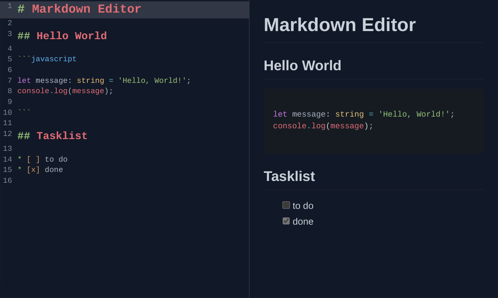

# Markdown Editor

## Stack

- [TypeScript](https://www.typescriptlang.org/) - JavaScript con sintaxis para tipos
- [CodeMirror](https://codemirror.net/) - Un editor de código extensible para la web
- [Remark](https://remark.js.org/) - Un procesador de Markdown extensible
- [Next.js](https://nextjs.org/) - Un framework de React con renderizado híbrido estático y de servidor.
- [Tailwind CSS](https://tailwindcss.com/) - Un framework de CSS
